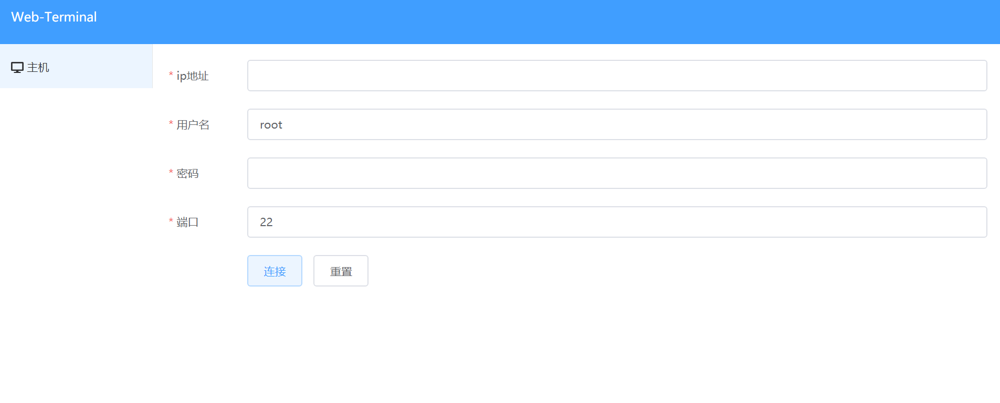
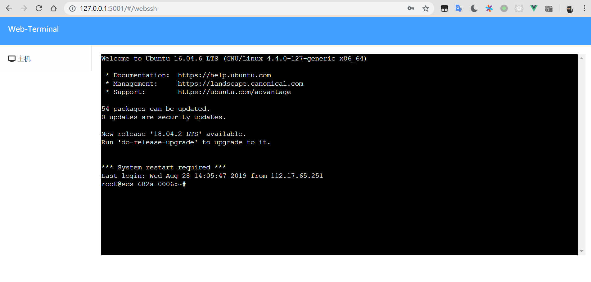

# Web-Terminal

用go和vue实现的简易版的网页版xshell. 前后端分离, [前端地址](https://github.com/chengjoey/web-terminal-client)


## Installation

Use the package manager golang to build web-terminal.

```bash
go get github.com/chengjoey/web-terminal
```

## Usage
linux:
```
web-terminal
```
windows:
```
web-terminal.exe
```
open browser http://127.0.0.1:5001/





web-terminal为前后端分离, 你可以自己实现前端, 然后将数据转成json结构再base64加密后传到后端
例如数据为:
```
{
    "username":"root",
    "password":"123456",
    "ipaddress":"127.0.0.1",
    "port":22
}
```
base64加密后:
```
msg = eyJ1c2VybmFtZSI6InJvb3QiLCAiaXBhZGRyZXNzIjoiMTI3LjAuMC4xIiwgInBvcnQiOjIyLCAicGFzc3dvcmQiOiIxMjM0NTYifQ==
```
传给后端:
```
// open websocket
url = ws://127.0.0.1:5001/ws?msg=eyJ1c2VybmFtZSI6InJvb3QiLCAiaXBhZGRyZXNzIjoiMTI3LjAuMC4xIiwgInBvcnQiOjIyLCAicGFzc3dvcmQiOiIxMjM0NTYifQ==
this.terminalSocket = new WebSocket(url)
```

## Contributing
joeycheng

## License
[DEMO](http://101.91.122.2:5001/)